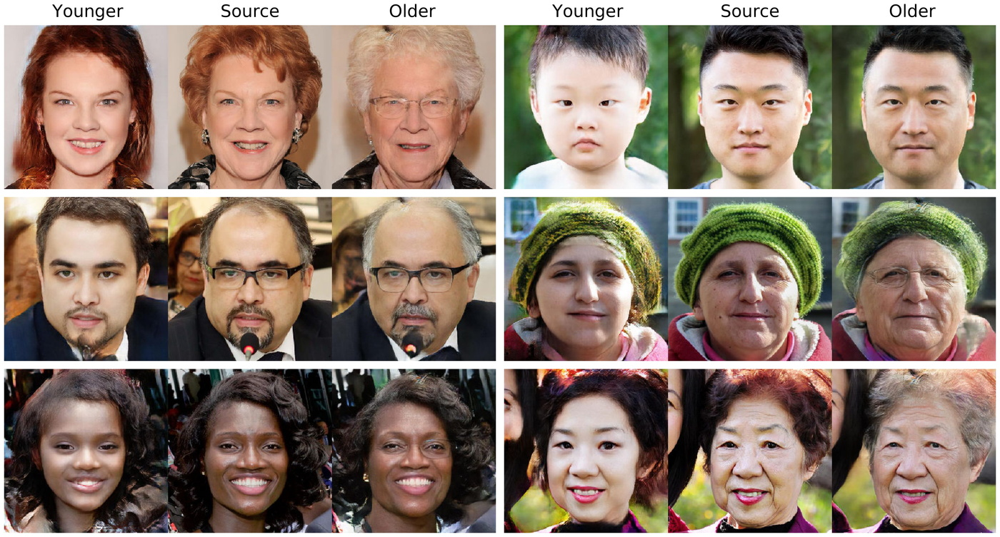

## Image sharpening using Knowledge Distillation along with Feed-forward Image Manipulation


## Image Sharpening using Knowledge Distillation


## Introduction

This project implements **Image Sharpening using Knowledge Distillation (KD)**. It leverages a pre-trained **teacher model** to guide the training of a lightweight **student model** that can enhance blurry images into sharper outputs.


## Goal

Train a compact student model to **generate sharper images from blurry inputs**, guided by a high-capacity teacher network trained for image restoration.


## Key Concepts

- **Teacher Model**: A deep network like Restormer, SwinIR, or MPRNet trained on image deblurring or restoration tasks.
- **Student Model**: A smaller CNN or UNet variant that learns to mimic the teacher.
- **Knowledge Distillation**: The process of transferring "knowledge" (outputs or internal features) from the teacher to the student.

## Feed-Forward Image Manipulation

The trained **student model** acts as a feed-forward network that directly maps blurry images to sharp images in **real-time**, avoiding slow optimization-based methods (e.g., latent code editing in GANs).


### Aging
<br>
[Full-size](https://drive.google.com/open?id=1MmY8yZbu0K_CH3dX30Yz-jMkd8C9xIuo)

## Usage
Based on [stylegan2](https://github.com/NVlabs/stylegan2) and 
[pix2pixHD](https://github.com/NVIDIA/pix2pixHD) repos. To use it, you must
 install their requirements.
 


### Fitting transform
In pix2pixHD directory.

Training command:
```
python train.py --name r512_smile_pos --label_nc 0
 --dataroot /mnt/generated_ffhq_smile --tf_log --no_instance
 --loadSize 512  --gpu_ids 0,1 --batchSize 8
```
Testing command:
```
python test.py --name r512_smile_pos --label_nc 0
 --dataroot /mnt/datasets/ffhq_69000 --no_instance --loadSize 512
 --gpu_ids 0,1 --batchSize 32 --how_many 100
```


